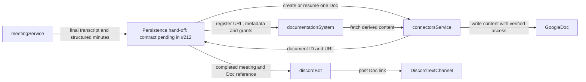

# Meeting Recording — Architecture

How the `/record` feature is split across a Discord **voice surface** (in the bot) and a stateful **`meeting` service**, and *why* the boundary sits where it does. Read this before changing either side — the two halves share a wire contract that must stay in lock-step.

Feature owner: Misty #92. Related: [platform ARCHITECTURE](ARCHITECTURE.md), [`services/meeting`](../services/meeting), [`discord-bot`](../discord-bot).

## What it does

A **linked** member (identity resolved via the directory — see "Authorization" below) runs `/record start` in a Discord voice channel, optionally supplying a name up to 100 characters. Before a recording is active, the first human to enter an empty voice channel receives a direct message prompting them to start one. The bot joins, and as people talk it streams their audio to the `meeting` service, which transcribes each speaker live into a rolling transcript. Recording ends on `/record stop` **or automatically when everyone leaves the voice channel** (the bot ends the meeting once no non-bot member remains). On stop the service turns the transcript into minutes (via the `llm` service), renders a PDF, and hands it back; the bot posts the **PDF** to the text channel, @-mentioning whoever started the recording. A supplied name becomes the PDF title and is sanitized into the attachment filename as `<name>_<YYYY-MM-DD_HHMM>.pdf` in America/Toronto; unnamed recordings use `meeting_<YYYY-MM-DD_HHMM>.pdf`, based on the meeting start time. Nothing is persisted — the transcript lives in memory for the meeting and is discarded after the report is returned. *Planned (#222/#223):* save the full transcript and generated minutes in one Google Doc, catalog its URL, and post the Doc link to the originating channel. Audio is never persisted. See "Durable records" below.

## The boundary, and the one constraint that forces it

There is exactly one hard constraint, and it determines the whole design:

> **Voice capture is physically bound to the bot.** `@discordjs/voice` joins and receives voice through the bot's own Discord gateway connection (`guild.voiceAdapterCreator`). Nothing outside the bot process can receive that audio.

Everything *downstream* of capture — transcription, minutes, PDF — is ordinary stateful work with no Discord dependency. So the split is:

| | **`discord-bot`** — the *voice surface* | **`meeting` service** — stateful processing |
|---|---|---|
| **Owns** | Voice receive, the `/record` lifecycle, streaming audio up, posting results | Live transcription, the rolling transcript, minutes, PDF |
| **Must not** | transcribe, summarize, or render | touch Discord |
| **Deps** | `@discordjs/voice`, `libsodium-wrappers` (RTP decrypt), `ws` | `amazon-transcribe` (streaming), PyAV (Opus decode), `fpdf2`, `httpx`, `platform_auth` |

The bot deliberately carries **no processing dependencies** (no `@aws-sdk`, no `pdfkit`) — it forwards Opus and posts what the service returns.

## Why the `meeting` service is *stateful*

Every other backend service (`team-tracking`, `documentation-system`, `llm`, `verification`) is a stateless source-of-truth: a request goes in, a response comes out, nothing is held between calls. `meeting` is the deliberate exception. **Live transcription requires *something* to hold the rolling transcript across the life of a meeting**, and the bot is the wrong place (we're keeping it lean and processing-free). So the service keeps an **in-memory registry of active meeting sessions**, each holding one live Transcribe stream per speaker plus the growing rolling transcript those streams produce (see "Live" below). This is a considered trade, not an accident — it's the price of "ask Misty during the meeting" being possible at all. The audio itself is *not* held: each chunk goes straight to AWS and is dropped.

State is still **ephemeral**: a session exists only while its meeting is live, and `POST /stop` (or an abrupt WebSocket disconnect) tears it down and closes its Transcribe streams. Nothing is written to disk, and nothing reaches a database or object store.

## Data flow

```text
Discord voice  ──Opus──▶  bot recorder ──sendFrame──▶  meetingClient (WS) ══▶  meeting service
                                                                                  │
                                                     per-speaker AWS Transcribe (persistent streams)
                                                                                  │
   /record stop ──POST /stop──────────────────────────────────────────────────▶  finalize:
                                                                    transcript → llm service → minutes
                                                                    → fpdf2 PDF
   channel.send(@requester + PDF) ◀──────── {pdf_b64, transcript, minutes} ◀──
```

**Live:** the bot's recorder taps each speaker's raw Opus packets and forwards them (untouched, no decode) over one WebSocket. The service decodes/resamples each speaker's audio and pushes it into that speaker's **persistent AWS Transcribe stream**, held open for the whole meeting. Audio is sent once and never replayed, so `GET /transcript` is a free read of what has finalized so far — it makes no AWS call and costs nothing to poll. `GET /meetings/{id}/transcript` exposes the transcript at any time — the hook that makes in-meeting "ask Misty" a fast-follow (the Q&A feature itself is not built yet).

**Stop:** `POST /meetings/{id}/stop` closes each speaker's Transcribe stream (concurrently, so latency is one flush and not N), assembles the transcript, calls the `llm` service for minutes, renders the PDF, returns it base64-encoded, and discards the session.

**Timeline correctness:** each forwarded frame carries `ts_ms` = milliseconds since the meeting started. AWS Transcribe reports word times relative to *each speaker's own* stream, and a speaker's stream carries only the frames they actually spoke — silence is never sent. So the service records an **anchor** whenever a frame arrives later than the audio already streamed accounts for, and maps word times through the nearest preceding anchor. Anchoring on the first `ts_ms` alone is not enough: it fixes only the speaker's first word, leaving cross-speaker order wrong past the opening minute and collapsing each speaker into one segment (the gap rule never sees a gap). `ts_ms` must always be sent and honored.

## Durable records (design, #212)

**Status: draft design — not built.** Google Docs is the agreed destination.
#222 creates and catalogs the record; #223 delivers its existing link. Until
those ship, the current behavior above still applies. #212 remains open until
the integration and policy decisions listed below are settled.

### Artifact, ownership, and identity

**One native Google Doc per completed meeting.** Save generated minutes,
decisions, action items, and the full transcript in separate readable sections.
Preserve transcript speaker labels, timestamps, and order. Include the meeting
title, channel, and start/end times. Both explicit stop and automatic stop use
the same persistence path. Audio is never persisted or written to disk.

**Google Docs and the catalog have different responsibilities.** The Doc is the
durable, member-readable transcript and notes. `documentation-system` owns its
catalog URL, team ownership/grants, and derived content snapshot for #125.
Catalog-associated meeting metadata retains resolved participant identities
(raw Discord IDs where lookup fails), channel IDs, start/end times, and
structured decisions/action items. The metadata schema and authenticated
hand-off are new work under #212/#222, not capabilities the current catalog
already provides. `meeting` remains the live-session service, with no new
meeting database of its own.

The current `StopResponse` already contains `transcript` and structured
`Minutes` fields (`summary`, `decisions`, `action_items`). Reuse them; no second
LLM call or PDF parsing is needed. The existing Discord PDF remains supported;
this design does not require a second PDF copy in Drive. Any future export can
be a separate feature, rather than making PDF the stored transcript.

**Identity is the session UUID, not a title or filename.** The bot already
generates a UUID at recording start. Retain it as `meeting_id` through stop and
every retry, with a durable mapping to the Google document ID, canonical URL
(`https://docs.google.com/document/d/{document_id}/edit`), and catalog entity.
Titles and folder names are presentation; two meetings in the same minute must
still have different identities. The real Doc URL goes through normal catalog
ingest; the UUID is never presented as a fetchable source URL.

### Google writes and recovery

**Writer: `connectors`.** Google API calls stay behind its injected provider
and an authenticated write endpoint, following #60/#82. The existing Google
connector only reads content; creating a native Doc, writing its body, and
placing it in the configured team folder are new capabilities. Google supports
[creating a native Doc in a folder through the Drive API](https://developers.google.com/workspace/docs/api/how-tos/documents).
#212 must specify the caller, endpoint/consumer scope, required Google write
scopes, and deployment configuration before implementation.

**File ownership must work with UTMIST's actual Google setup.** A service account
must create files in a Shared Drive; otherwise use OAuth on behalf of a user
who can own them. Sharing an ordinary My Drive folder with the existing service
account does not give it file ownership or storage quota. See Google's
[service-account storage constraint](https://developers.google.com/workspace/drive/api/guides/about-shareddrives).
Google Group administration (#236/#237) is separate from this authentication
choice; it becomes a dependency when using automated team-group provisioning.

**Persistence and delivery have separate outcomes.** #222 owns Doc creation,
content, permissions, catalog registration, and recoverable partial failures.
Serialize attempts for a meeting and retain the returned document ID before
continuing. If a create call times out with an unknown outcome, reconcile that
attempt before creating again; URL dedup alone cannot prevent duplicate Docs.
Retries resume the existing artifact and do not overwrite later human edits.
#223 posts the saved URL and retains the Discord message reference for delivery
retries. A Discord failure never reruns transcription or creates another Doc.

**The current stop contract is not a durable hand-off.** `/stop` discards the
session before the caller can confirm an external save. #212 must define where
the finalized payload and retry state become durable, acknowledgement/cleanup
ordering, and the remaining crash-loss window. Until that is specified, this
draft does not promise restart-safe recovery merely because Google Docs is
the destination. Failed persistence must be surfaced; never announce a partial
Doc/catalog write as complete or log transcript content.



The hand-off box is a contract to assign in #212, not a new service or scheduler.
Live subtitles (#224) and current-meeting Q&A (#225) still read in-memory session
state and do not wait for Google Docs persistence.

### Visibility, retention, and removal

**Effective Drive permissions and catalog grants must agree.** Resolve the
meeting's team audience through trusted channel settings (#238) and verified
Google access. An absent mapping grants no member access. A missing or broader
destination is an explicit persistence failure, not a reason to use public
link sharing. Posting a link does not grant Drive access, and the originating
Discord channel must be appropriate for the meeting's audience.

The proposed `Interdepartmental/Meeting Notes/{voiceChannelSnowflake}/` layout
is only suitable if its effective access matches the intended team audience.
A channel-keyed folder survives renames but is not an authorization boundary.
Validate ancestor and Shared Drive permissions before writing private content:
removing a child's direct shares cannot remove inherited access. Use a
restricted parent or a supported limited-access folder, and fail closed if the
intended effective permissions cannot be established. See Google's
[permission propagation rules](https://developers.google.com/workspace/drive/api/guides/manage-sharing#how_permissions_propagate).
Historical records must not be silently broadened when channel teams change;
reconciliation must cover both Drive access and catalog grants (#76).

**Consent and retention remain proposals for review.** The earlier draft proposed
a recording-start notice with no opt-out and indefinite retention. Saving the
full transcript makes those policy choices material: #212 must confirm the
notice/consent behavior, lifetime, and expiry policy before rollout. Any notice
must explicitly describe transcript and minutes storage, intended audience, and
the removal path. Member departure revokes access through the chosen Google
membership/grant path; it does not itself remove that person's speech.

**Member removal path.** A member contacts a Misty admin with the Doc link or
meeting ID. The admin coordinates with the Drive owner/admin and bot/catalog
maintainers, and confirms completion only after all Misty-managed copies are
removed or made inaccessible: the source Doc, catalog content and participant
metadata, downstream index entries, retained retry payloads, and the bot's
Discord PDF/link message. Keep only the minimal non-content audit/tombstone
needed to prevent a retry or refetch from recreating a removed record. Deleting
the Drive file alone is insufficient: failed catalog refetches preserve old
snapshots. Copies already downloaded by members cannot be recalled; explain
that limitation to the requester. Automated expiry/removal and its runbook need
explicit implementation owners before rollout.

### Remaining #212 decisions

- Specify the metadata schema, service caller, authenticated endpoint/scope,
  durable retry state, and finalization acknowledgement described above.
- Confirm available Google credentials and folder IDs, which voice/text channel
  setting defines the meeting audience, and safe behavior while managed Google
  Groups are unavailable. Do not assume an unconfigured destination is private.
- Decide how human edits update fetched catalog content and structured metadata,
  including how a generation-time minutes snapshot is distinguished from later
  edited notes. Decide handling of source deletion and access revocation.
- Confirm consent, retention/expiry, and removal enforcement ownership. Keep
  #222/#223 blocked on #212 until the remaining design is reviewable and accepted.

## The wire contract (keep both sides in lock-step)

The bot's `meetingClient.encodeFrame` and the service's `_parse_frame` are inverses. **If you change one, change the other.**

- **WebSocket:** `{wsUrl}/meetings/{sessionId}/stream?guild_id={guildId}` — the consumer key is sent as the **first WS text frame** `{"key": "…"}` (keeps it out of URLs/logs); the service also still accepts a `?key=` query param.
- **Binary audio frame:** `[2-byte big-endian speaker_id length][speaker_id UTF-8][8-byte big-endian ts_ms][raw Opus payload]`
- **Control frame (text/JSON):** `{"speaker_id": "...", "display_name": "..."}` — registers the display name shown for a speaker.
- **Auth:** the `platform_auth` consumer key — on the WS as the first text frame `{"key": "…"}` (or a `?key=` query param; both server-supported), and on `GET /transcript` / `POST /stop` as the `X-API-Key` header. The `meetings` scope is required.
- **`POST /stop` request:** optional `{ "title": "..." }` body, limited to 100 characters. A supplied title wins over the LLM-generated title. **Response:** `{ transcript, minutes, pdf_b64 }` (PDF base64-encoded). The bot posts it @-mentioning whoever ran `/record start` — including on the auto-stop path, where there is no interaction to read the requester off.

## The "separate surface" in the bot

Voice recording does **not** go through the bot's neutral slash-command path (`defineCommand` → `router.js` → a surface-agnostic handler returning a reply payload). That abstraction is for stateless request/response commands; a long-lived, stateful recording that posts file attachments does not fit it. Forcing it in (as an earlier iteration did) required smuggling live Discord objects through the router and bolting an attachment side-channel onto the reply contract.

Instead, `/record` is a **dedicated path in the Discord adapter**: `adapters/discord/index.js` intercepts `record` interactions *before* neutral dispatch, and `adapters/discord/recording.js` drives `meetingSurface` directly with the live interaction. `router.js` stays completely clean. The command is still declared (so it registers as a slash command) but its handler is never reached.

**Surface isolation** is preserved: only `index.js`, `registerCommands.js`, and `adapters/*` (plus the sanctioned voice modules `recorder.js`/`meetingSurface.js`) import `discord.js`/`@discordjs/voice`. `meetingClient.js` is transport-only (no Discord). The attachment poster is Discord-specific, so it is built in `index.js` (the composition root) and **injected** into `meetingSurface` — keeping `context.js` free of any Discord import.

**Authorization.** Because `/record` bypasses `router.js`, it also bypasses the router's single Policy Enforcement Point. So the dedicated handler re-runs the same `resolvePrincipal → authorize(policy, …)` sequence itself — but it reads `policy` from the command metadata (per-subcommand `auth`, else command `auth`, fail-secure to `'linked'`) rather than hardcoding it, so the two can't drift. The policies are deliberately split:

- `start` → `'linked'`: starting a recording consumes resources (a voice connection + a live session), so an unlinked caller is turned away with the standard "link your account" message and never reaches `meetingSurface.start`. Fails **closed** if the directory is unavailable.
- `status` / `stop` → `'public'`: `status` is a local read (no directory call), and `stop` is *de-escalating* — gating it would mean a directory outage could strand a running recording (with no length cap, that's the memory escape hatch). So both work regardless of link state.

If `start` is ever silently downgraded to public, any guild member could drive live voice capture unauthenticated — keep it gated.

The dedicated adapter also checks voice-channel context before changing state.
A start attempt is refused while a recording is already active in the guild —
whether the caller is in the recorded channel (a duplicate start) or a
different one (Misty is busy elsewhere in the server; recordings are one at a
time **per guild**, sessions being keyed by `guildId`, not a single global
slot) — and a stop from outside the recorded channel is refused too, with the
active channel and auto-stop guidance. That stop guard has one exception:
`stop` is public precisely so anyone can end a runaway recording, so it does
not apply once the recorded channel is already empty of humans (the same
`humansIn` head-count auto-stop itself uses). Without that carve-out, a missed
`voiceStateUpdate`, or a recorded channel that's since gone private, full, or
been deleted, would strand the recording until the 4h backstop with nobody
able to stop it. Status always names the recorded channel; when idle it tells
the caller that Misty will join the voice channel when recording starts, and
when the recorded channel is empty it notes the imminent auto-stop and the
`/record stop` option. Start attempts while the recorded channel is empty
similarly explain that Misty is wrapping up and can be ended immediately with
`/record stop`.

If a moderator moves Misty during a recording, the adapter updates the session's
voice channel before checking auto-stop. Status, stop permissions, and the
empty-channel check then follow the destination channel. The minutes still post
to the text channel where recording was started.

**Auto-stop.** `wireDiscordClient` listens for `voiceStateUpdate` (via `createAutoStop`); when the channel being recorded goes empty of non-bot members it **debounces** — schedules a stop after a grace period (`AUTO_STOP_GRACE_MS`) and cancels it if a human is back either on a later event or at fire time (re-check). This avoids a transient client blip or a voice-region failover irreversibly finalizing a live meeting on a single stray "last member left" event. When it does fire it calls `meetingSurface.stop(guildId)` — the same path as `/record stop`. The recorded channel is read from the live session via `meetingSurface.activeSession(guildId)` (which returns the `{ sessionId, voiceChannel }` snapshot opaquely, so `meetingSurface` keeps no `discord.js` dependency), which keeps the head-count honest and makes the listener a no-op once a session is torn down. Each pending timer is **bound to its `sessionId`**, so a timer scheduled for one recording can never terminate a *later* recording that reuses the same guild (a real bug caught in review): a new recording always schedules its own full-grace timer, and a stale one no-ops at fire time. The head-count is computed from **`guild.voiceStates.cache`** (maintained by the `GuildVoiceStates` intent — the same one that powers voice receive), *not* from `channel.members`. `channel.members` resolves each occupant to a `GuildMember` via `guild.members.cache`, which only the privileged `GuildMembers` intent keeps populated; without it that resolution is unreliable and miscounts occupants — including the recorder bot itself, whose member often isn't cached — which is what made auto-stop silently never fire in an early version. Counting voice states avoids that dependency entirely, and the recorder bot is excluded by its own user id (`client.user.id`), so `GuildMembers` is deliberately **not** required.

## Deployment

`meeting` is a private Railway service (`meeting.railway.internal:<PORT>`), like the other services: `platform_auth` consumer keys, `/health`, Dockerfile build (no ffmpeg binary — PyAV bundles its own), GitHub-connected auto-deploy on push to `staging`. It needs AWS credentials (Transcribe, via the standard chain), an `llm` consumer key (for minutes), and its own `CONSUMER_KEYS` set. The bot gets a `meeting` consumer key (`MEETING_API_KEY`) and `MEETING_BASE_URL=http://meeting.railway.internal:<PORT>`; the WebSocket rides Railway's private network. If `MEETING_BASE_URL` is unset the bot boots fine and `/record` reports "not configured" — the feature degrades gracefully.

## Known limitations & live-verify items

- **Concurrent stream limits:** one open Transcribe stream per active speaker, held for the whole meeting — a 10-person call is 10 concurrent streams. Confirm the account's concurrent-stream quota before a large meeting; exceeding it surfaces as a `meeting.audit` warning and that speaker retries, then drops out.
- **AWS session restarts:** Transcribe ends a session on its own (idle timeout, 4h cap). The wrapper reopens on the next audio and offsets the new session's word times by the audio already delivered — unit-tested against a fake, not yet observed against a real timeout.
- **Speaker-timeline anchoring:** a speaker's stream carries only the frames they spoke, so word times are mapped onto meeting time via anchors recorded at each detected silence. The 200 ms tolerance is reasoned from Discord's ~20 ms cadence, not measured live.
- **Meeting length backstop:** the normal end is `/record stop` or auto-stop-on-empty, with a **4h `max_meeting_ms` backstop** so a forgotten meeting can't run indefinitely. Set `MAX_MEETING_MS` to another value, or `None`, to change or disable it.
- **A dropped WebSocket is recoverable, not fatal.** The service holds a disconnected session for `DISCONNECT_GRACE_S` (default 60s) instead of discarding it, and the bot responds to an unexpected `onClose`/`onError` by running the normal finalize (`POST /stop`) rather than announcing a lost meeting — so the minutes still post. The channel only sees "could not be recovered" if that finalize itself fails. Both halves are required: without the server-side hold the bot's `/stop` would 404, and without the bot-side salvage the held session would just expire. The close code is logged on both sides, which is what makes the *next* dropped socket diagnosable.
- **Not built yet:** the in-meeting `/ask` Q&A feature (only the `GET /transcript` hook it will use).
